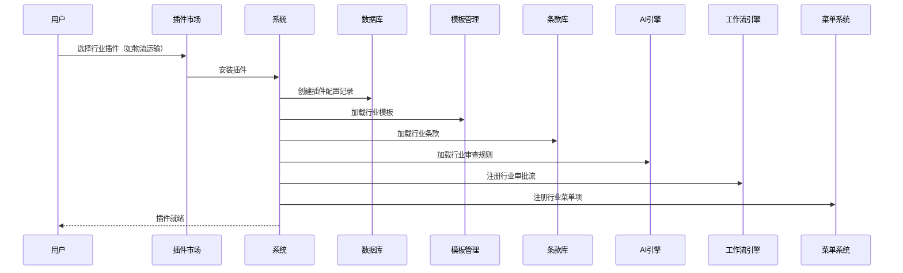

# 易合同 — 多行业插件化合同管理平台 · 产品架构重构方案 v2.0

> 更新日期：2026-07-09
> 定位：面向中小企业的灵活多行业垂直插件式合同管理应用工具

---

## 一、产品定位与核心差异

### 1.1 一句话定位

**「易合同」= 合同管理通用底座 + 行业插件市场 + 企业定制引擎**

- **通用底座**：合同建档、AI解析、台账、提醒、成员管理等基础功能，免费/低价开放
- **行业插件**：按行业深度定制模板库、审批流、AI识别模型、合规规则，按需付费
- **企业定制**：在行业插件基础上，为单一企业做二次定制（私有模板、专有流程、API集成），按项目计价

### 1.2 差异化核心

| 维度 | 传统CLM（用友/致远/泛微） | 电子签厂商（法大大/契约锁） | **易合同（我们）** |
|------|------------------------|------------------------|-----------------|
| 目标客户 | 中大型企业 | 通用签约场景 | **中小企业 + 垂直行业** |
| 产品形态 | 大而全，实施重 | 轻量签署，功能薄 | **底座轻 + 行业插件深** |
| 行业适配 | 靠实施顾问定制 | 无行业差异 | **插件化开箱即用** |
| AI能力 | 有限 | 无 | **AI条款审查 + 行业规则引擎** |
| 定价 | 20-200万高价 | 按次/按量付费 | **底座免费 + 插件按行业定价** |
| 部署 | 本地为主 | SaaS | **SaaS + 私有化两种** |

---

## 二、市场竞品定价参考（2026年）

### 2.1 国内市场行情

| 产品 | 模式 | 价格区间 | 备注 |
|------|------|---------|------|
| 超易合同管理 | SaaS | 600元/用户/年 | 无合同数量限制 |
| 致远互联合同管理 | SaaS/本地 | SaaS 180-480元/人/年；本地 15-50万 | 小团队起步2-6万/年 |
| 简道云合同管理 | SaaS | 168-365元/人/年 | 含免费版 |
| 泛微合同管理 | SaaS | 9800元/年(20账号) | 常与OA打包 |
| 法大大 | 按签署量 | 350元/40份起 | 纯签署场景 |
| 契约锁 | SaaS/本地 | 1-3万/年(基础版) | 政企安全 |
| 用友BIP | 本地 | 20万起 | 大型企业 |
| 金蝶云·星辰 | SaaS | 数千起/年 | 小微企业版 |
| **我们定价（目标）** | **SaaS** | **基础版0元 + 行业插件 2000-9800元/年** | **见定价方案** |

### 2.2 国际市场行情

| 产品 | 价格 | 特点 |
|------|------|------|
| PandaDoc | $19-49/用户/月 | AI起草 |
| DocuSign CLM | ~$80/用户/月 | 电子签标准 |
| Ironclad | $25,000-45,000/年 | 企业级 |
| ContractPodAi | $50,000+/年 | AI原生 |
| OpenCLM | **开源免费** | **AGPL v3 自托管** |
| Odoo(合同模块) | 社区版免费，企业版付费 | 模块化ERP |

### 2.3 定价策略建议

```
定价模板：

┌─────────────────────────────────────────────────────┐
│ 基础版（免费）                                        │
│ - 50份合同存储                                       │
│ - 基础AI解析（5次/月）                                │
│ - 到期提醒                                           │
│ - 1个主体                                            │
├─────────────────────────────────────────────────────┤
│ 专业版（¥999/年）                                     │
│ - 500份合同存储                                      │
│ - AI解析不限次                                       │
│ - 财务台账                                           │
│ - 合作方管理                                         │
│ - 2个主体                                            │
│ - 基础报表                                           │
├─────────────────────────────────────────────────────┤
│ 行业插件（每个 ¥2,000-¥9,800/年）                     │
│ - 按行业独立选择，可叠加                                │
│ - 行业专属模板库 + 条款库                              │
│ - 行业AI审查规则                                      │
│ - 行业定制工作流                                      │
│ - 行业合同版本管理                                    │
├─────────────────────────────────────────────────────┤
│ 企业定制（¥50,000起 / 项目）                           │
│ - 专属行业插件开发                                    │
│ - 私有化部署                                         │
│ - API深度集成                                        │
│ - 定制审批流/报表                                     │
│ - 品牌定制                                           │
└─────────────────────────────────────────────────────┘
```

---

## 三、参考项目研究

### 3.1 关键开源参考项目

| 项目 | 技术栈 | Star | 对我们的参考价值 |
|------|--------|------|----------------|
| **OpenCLM** (openclm.ai) | Node.js/React/PostgreSQL | 新项目 | **多租户架构、RBAC、审批流、电子签集成** |
| **Odoo Contract** | Python/PostgreSQL | 90K+ | **模块化插件架构、社区生态模式** |
| **ERPNext** | Python/MariaDB | 20K+ | **开源免费策略、行业化定制** |
| **华炎合同管理** (Gitee) | Node.js/MongoDB | — | **国产开源合同管理、对象化配置** |
| **Themis（忒弥斯）** | Spring AI + LangChain4j | — | **AI驱动的合同审查、RAG技术** |
| **思通数科合同审查** | Python/NLP | — | **中文合同审查、规则引擎+AI双驱动** |
| **Claude for Legal** (Anthropic) | Plugin-based | — | **插件架构设计参考、法律AI Agent** |

### 3.2 可借鉴的核心设计

**从 OpenCLM 借鉴**：
- 多租户数据隔离（组织级）
- 12种预置角色与细粒度权限
- 阶段化合同生命周期管理
- 义务监控与合规检查引擎

**从 Odoo 借鉴**：
- 模块化插件系统（社区贡献 + 官方认证）
- 插件市场生态
- 可视化低代码配置字段与流程

**从 华炎合同 借鉴**：
- 国内合同管理场景贴合度高
- 对象化配置（无代码扩展字段）
- 审批流内置

**从 Claude Plugins 借鉴**：
- Skills + Commands 双层能力定义
- 插件通过 Markdown + JSON 声明式配置
- MCP 协议连接外部工具

---

## 四、产品架构重构设计

### 4.1 整体架构图

```
┌─────────────────────────────────────────────────────────────┐
│                        用户层                                │
│   Web端 (Next.js)   │   移动端 (小程序/H5)   │   API开放     │
└──────────────────────────┬──────────────────────────────────┘
                           │
┌──────────────────────────▼──────────────────────────────────┐
│                    应用层 - 通用底座                          │
│  ┌────────┬────────┬────────┬────────┬────────┬─────────┐  │
│  │合同管理│ AI解析 │财务台账 │提醒中心 │合作方  │ 成员    │  │
│  │  CRUD  │条款提取│应收/付│ 到期提醒 │ 管理   │ 管理    │  │
│  │ 搜索   │风险识别│月台账  │自定义提醒│ 供应商 │ 角色设置│  │
│  │ 分类   │ 摘要   │ 报表   │ 提醒统计│ 客户   │ 审批流  │  │
│  └────────┴────────┴────────┴────────┴────────┴─────────┘  │
└──────────────────────────┬──────────────────────────────────┘
                           │
┌──────────────────────────▼──────────────────────────────────┐
│                 插件层 - 行业插件市场                         │
│                                                              │
│  ┌────────┐  ┌────────┐  ┌────────┐  ┌────────┐  ┌──────┐  │
│  │ 🏠     │  │ 🍜     │  │ 🚚     │  │ ⚖️     │  │ 💻   │  │
│  │房东收租 │  │餐饮管理 │  │物流运输 │  │律所法务│  │科技IP │  │
│  │ 模板    │  │ 模板    │  │ 模板    │  │ 模板   │  │ 模板  │  │
│  │ 条款库  │  │ 条款库  │  │ 条款库  │  │ 条款库 │  │ 条款库│  │
│  │ 水电计费│  │ 供应商  │  │ 运单条款│  │ 案件   │  │ 订阅  │  │
│  │ 押金    │  │ 月度计  │  │ 计价规则│  │ 文书   │  │ 计费  │  │
│  │ 管理    │  │ 划付款  │  │ 赔付条款│  │ 生成   │  │ 管理  │  │
│  └────────┘  └────────┘  └────────┘  └────────┘  └──────┘  │
│                                                              │
│   ┌─────────────────────────────────────────────────────┐   │
│   │ 企业定制插件 - 为单一企业深度定制                     │   │
│   │ 私有模板库 / 专有审批流 / 定制AI模型 / 系统集成      │   │
│   └─────────────────────────────────────────────────────┘   │
└──────────────────────────┬──────────────────────────────────┘
                           │
┌──────────────────────────▼──────────────────────────────────┐
│                    AI 引擎层                                 │
│  ┌─────────────┐  ┌─────────────┐  ┌──────────────────┐    │
│  │ 通用AI解析   │  │ 行业AI规则   │  │ 企业定制AI模型   │    │
│  │ LLM合同解析  │  │ 行业条款库   │  │ 私有数据微调    │    │
│  │ 条款提取     │  │ 合规检查     │  │ 专有规则引擎    │    │
│  │ 风险识别     │  │ 行业版本对比 │  │ 集成客户系统    │    │
│  └─────────────┘  └─────────────┘  └──────────────────┘    │
└──────────────────────────┬──────────────────────────────────┘
                           │
┌──────────────────────────▼──────────────────────────────────┐
│                   数据层                                     │
│  ┌──────────────┐  ┌──────────────┐  ┌──────────────────┐  │
│  │  PostgreSQL  │  │  文件存储     │  │  搜索引擎(ES)    │  │
│  │  结构化数据  │  │  PDF/Word    │  │  全文检索        │  │
│  │  多租户隔离  │  │  附件/图片   │  │  合同快速查找    │  │
│  └──────────────┘  └──────────────┘  └──────────────────┘  │
└─────────────────────────────────────────────────────────────┘
```

### 4.2 通用底座（免费版/所有用户可用）

| 模块 | 功能 | 优先级 |
|------|------|--------|
| 合同存档 | 上传/录入/编辑/删除/搜索/筛选 | P0 已有 |
| 合同分类 | 文件夹管理/标签/颜色标识 | P0 已完成 |
| AI基础解析 | OCR文字识别/关键字段提取/摘要生成 | P0 已有 |
| 到期提醒 | 合同到期/续约自动提醒/微信通知 | P0 已有 |
| 套餐管理 | 使用量统计/升级引导 | P1 已有 |
| 主体管理 | 多主体切换（租户）/组织架构 | P1 已有 |
| 成员管理 | 添加成员/角色权限 | P1 已有 |

### 4.3 行业插件矩阵

| 行业 | 插件ID | 核心功能 | 定价(年) | 当前状态 |
|------|--------|---------|---------|---------|
| **🏠 房东收租** | `landlord` | 租金台账、水电读数、押金管理、房源管理、账单自动生成 | ¥2,000 | 部分开发中 |
| **🍜 餐饮管理** | `catering` | 供应商合同、证照管理、月度付款计划、设备管理、食材分类 | ¥3,000 | 部分开发中 |
| **🚚 物流运输** | `logistics` | 运输合同模板、运单自动关联、赔付条款库、司机/车辆管理 | ¥4,800 | **新规划** |
| **⚖️ 律所法务** | `legal` | 案件关联合同、法律文书模板、诉讼费管理、律所合作分成 | ¥5,800 | 菜单已配置 |
| **💻 科技/互联网** | `tech` | 知识产权合同、订阅计费管理、SLA条款库、版本授权管理 | ¥4,800 | 菜单已配置 |
| **🏗️ 工程建筑** | `construction` | 总分包合同树、工程进度款管理、质保金管理、变更签证 | ¥6,800 | **新规划** |
| **🛒 采购/供应链** | `procurement` | 供应商合同、框架协议、价格条款库、采购计划联动 | ¥3,800 | **新规划** |
| **💼 人力资源** | `hr` | 劳动合同模板、保密协议(NCA)竞业限制、薪酬条款、离职管理 | ¥2,800 | **新规划** |
| **📦 电商/零售** | `retail` | 平台入驻合同、代销协议、对账条款、退换货规则 | ¥3,800 | **新规划** |
| **🏥 医疗/健康** | `healthcare` | 医疗合同模板、合规条款(HIPAA)、数据保密、临床试验协议 | ¥6,800 | **新规划** |

> 注：物流运输、工程建筑、采购/供应链、人力资源、电商零售、医疗健康为新规划行业插件

### 4.4 企业定制模块

| 服务项目 | 价格 | 说明 |
|---------|------|------|
| 私有模板库 | ¥20,000起 | 行业模板基础上，为企业定制专属模板 |
| 专有条款库 | ¥15,000起 | 企业历史合同训练条款库 |
| 定制审批流 | ¥20,000起 | 企业独有审批流程/多级会签 |
| 定制AI模型 | ¥50,000起 | 用企业数据微调AI，提升识别准确率 |
| 系统集成 | ¥30,000起 | 对接企业微信/钉钉/飞书/金蝶/用友等 |
| 私有化部署 | ¥30,000起 | 本地/私有云部署 |
| 全案定制 | ¥80,000-300,000 | 从0到1完整定制 |

---

## 五、插件化核心机制设计

### 5.1 插件定义规范

每个行业插件是一个**自描述的功能包**，包含：

```
industry-plugin/
├── manifest.json           # 插件元数据（ID/名称/版本/依赖/定价）
├── scene-config.json       # 场景与功能映射
│
├── templates/              # 行业合同模板
│   ├── lease-template.docx
│   └── purchase-template.docx
│
├── clause-library/         # 行业条款库（JSON结构化）
│   ├── terms.json
│   └── compliance-rules.json
│
├── workflows/              # 行业审批流定义
│   ├── approval-flow.json
│   └── payment-flow.json
│
├── ai-rules/               # 行业AI审查规则
│   ├── risk-points.json
│   └── compliance-check.json
│
├── fields/                 # 行业自定义字段
│   └── extended-fields.json
│
├── reports/                # 行业报表模板
│   └── industry-report.json
│
├── api/                    # 行业专用API（可选）
│   └── routes.js
│
└── migration/              # 数据库迁移脚本
    ├── 001-init.sql
    └── 002-update.sql
```

### 5.2 插件注册与加载



### 5.3 插件的运行时隔离

```
┌──────────────────────────────────────────────────┐
│  shared/            # 共享核心层                   │
│  ├─ contract-core   # 合同CRUD/搜索/解析          │
│  ├─ auth            # 认证授权                     │
│  ├─ tenant          # 多租户                       │
│  └─ payment         # 支付                         │
├──────────────────────────────────────────────────┤
│  plugins/            # 插件沙箱层                  │
│  ├─ landlord/       # 房东插件（独立命名空间）      │
│  │   ├─ components/ # 业务组件                    │
│  │   ├─ api/        # 专用API路由                 │
│  │   ├─ models/     # 扩展数据模型                │
│  │   └─ hooks/      # 业务逻辑                    │
│  ├─ catering/       # 餐饮插件                    │
│  ├─ logistics/      # 物流插件                    │
│  └─ ...             # 其他行业插件                 │
├──────────────────────────────────────────────────┤
│  config/             # 配置层                      │
│  ├─ plugin-registry  # 插件注册表                  │
│  ├─ scene-mapping    # 场景-功能映射               │
│  └─ pricing          # 定价配置                    │
└──────────────────────────────────────────────────┘
```

### 5.4 插件市场机制

```
插件市场功能：

1. 发现
   - 分类浏览（按行业/热度/评分）
   - 搜索
   - 免费试用期（14天）

2. 安装
   - 一键启用（修改配置即可，无需部署）
   - 版本管理
   - 依赖检查

3. 计费
   - 单独订阅或捆绑购买
   - 多插件折扣（2个9折，3个8折）
   - 年度付享85折

4. 评价
   - 用户评分
   - 使用反馈
   - 需求投票

5. 生态
   - 官方自研插件（核心）
   - 合作伙伴插件（审核制）
   - 开源社区插件（免费/审核制）
```

---

## 六、行业插件详细设计（示例：物流运输）

以**物流运输行业**为例，说明插件如何深度定制：

### 6.1 物流合同特点

| 特点 | 通用合同 | 物流合同 |
|------|---------|---------|
| 计费方式 | 固定金额/单价 | **按重量/体积/公里/件数复合计费** |
| 关键条款 | 质量/交付/付款 | **赔付标准、时效承诺、货损责任** |
| 关联单据 | 无 | **运单/签收单/对账单** |
| 合同期限 | 固定期限 | **框架协议+具体运单** |
| 合同方 | 甲乙两方 | **托运方 + 承运方 + 实际承运人** |

### 6.2 物流插件功能清单

```
物流合同管理插件
├── 模板库
│   ├── 运输服务合同（整车/零担）
│   ├── 仓储服务合同
│   ├── 快递配送合同
│   └── 物流框架协议
├── 条款库
│   ├── 货损赔付条款（按运输方式）
│   ├── 时效承诺条款
│   ├── 签收确认条款
│   └── 保价条款
├── AI审查规则
│   ├── 赔付率合理性检查
│   ├── 责任划分清晰度检查
│   ├── 计费公式验证
│   └── 免责条款范围检查
├── 扩展字段
│   ├── 运输方式（整车/零担/快递/冷链）
│   ├── 计费模式（按吨/按方/按公里/按件）
│   ├── 保险要求
│   └── 装卸责任方
└── 关联功能
    ├── 运单管理（关联合同）
    ├── 车辆/司机档案
    ├── 运费对账
    └── 赔付记录
```

---

## 七、实施路线图

### Phase 1（1-2个月）- 底座加固 + 插件化改造
- [ ] 现有通用底座功能完整化（合作方管理、报表完成开发）
- [ ] 完成插件加载架构（manifest注册、场景筛选、菜单映射）
- [ ] 数据模型插件化改造（Prisma schema支持插件扩展字段）
- [ ] 完成房东+餐饮两个插件的完整功能开发（水电/押金/设备）
- [ ] 部署插件市场管理后台

### Phase 2（2-3个月）- 新行业插件开发
- [ ] 物流运输插件（核心功能开发）
- [ ] 采购/供应链插件
- [ ] 人力资源插件
- [ ] 电子签集成（法大大/腾讯电子签API接入）
- [ ] 微信通知/小程序接入

### Phase 3（1-2个月）- AI能力升级
- [ ] 行业级AI审查规则引擎（按插件加载规则）
- [ ] RAG条款库检索增强
- [ ] 合同版本差异对比
- [ ] 企业定制AI模型训练微调工具

### Phase 4（持续）- 生态与商业化
- [ ] 第三方开发者入驻插件市场
- [ ] 企业定制服务流程标准化
- [ ] 私有化部署方案
- [ ] 企业微信/钉钉/飞书深度集成

---

## 八、技术栈升级建议

| 层 | 当前技术 | 升级建议 | 原因 |
|---|---------|---------|------|
| 前端 | Next.js 14 + Tailwind | ✅ 保持不变 | 足够支撑 |
| 数据库 | SQLite | ⚠️ **迁移PostgreSQL** | 多租户隔离/插件扩展字段 |
| ORM | Prisma 5 | ✅ 保持不变 | 满足需求 |
| 全文搜索 | 无 | ➕ **引入 Elasticsearch** | 合同全文搜索 |
| AI | OpenAI API | ✅ 保持 + 增加国产模型 | 豆包/DeepSeek 降本 |
| 认证 | Supabase Auth | ✅ 保持 + 增加微信登录 | 小程序生态 |
| 部署 | Vercel | ⚠️ **迁移国内云** | 合规/访问速度 |
| 文件存储 | 未对接 | ➕ **接入阿里云OSS/腾讯COS** | 正式生产 |

---

## 九、定价与商业化总结

```
┌──────────────────────────────────────────────────────────┐
│                    易合同 定价体系                        │
├──────────────────────────────────────────────────────────┤
│                                                          │
│  FREE 免费版       ───→   基础功能 + 50份合同             │
│  ¥0/年                                                  │
│                                                          │
│  PRO 专业版        ───→   基础功能全解锁 + 500份合同      │
│  ¥999/年                                                │
│       ├── + 房东插件 ¥2,000/年     套餐价 ¥2,499/年      │
│       ├── + 餐饮插件 ¥3,000/年     套餐价 ¥3,499/年      │
│       ├── + 物流插件 ¥4,800/年     套餐价 ¥4,999/年      │
│       ├── + 律所插件 ¥5,800/年     套餐价 ¥5,999/年      │
│       └── + 任意3插件             套餐价 ¥6,999/年      │
│                                                          │
│  ENTERPRISE 企业定制 ───→  全功能 + 私有化 + 定制开发      │
│  ¥50,000-300,000 / 项目                                 │
│                                                          │
│  核心策略：                                               │
│  - 基础版免费引流，行业插件赚利润                          │
│  - 多插件捆绑折扣提升客单价                               │
│  - 企业定制做高客单价（利润核心）                          │
│  - 对比竞品：价格仅为泛微/致远同等的 1/5 - 1/10           │
│                                                          │
└──────────────────────────────────────────────────────────┘
```

---

## 十、与当前代码库的差距分析

| 要求 | 当前状态 | 需改造 |
|------|---------|-------|
| 插件化加载架构 | ❌ 无 | 新建 `plugins/` 目录 + 注册体系 |
| 插件市场 | ❌ 无 | 新建市场前后端 |
| 行业模板库 | ⚠️ 菜单有配置，页面未实现 | 开发模板管理页面 |
| 条款库 | ❌ 无 | 新建条款管理模块 |
| 行业AI规则 | ❌ 无 | 将AI解析改为按行业加载规则 |
| 扩展字段系统 | ❌ 无 | Prisma JSON字段 + 配置化渲染 |
| 企业定制流程 | ❌ 无 | 需完整设计 |
| 电子签集成 | ❌ 无 | 接入法大大/腾讯电子签 |
| 多租户数据隔离 | ✅ 已有 | 保持并强化 |
| 基础合同管理 | ✅ 已完整 | 保持 |
| AI解析 | ✅ 已有 | 升级为按行业规则引擎 |
| 套餐分级 | ✅ 已有 | 扩展为新版定价模型 |
| 菜单筛选 | ✅ 已有 | 扩展为插件驱动 |
